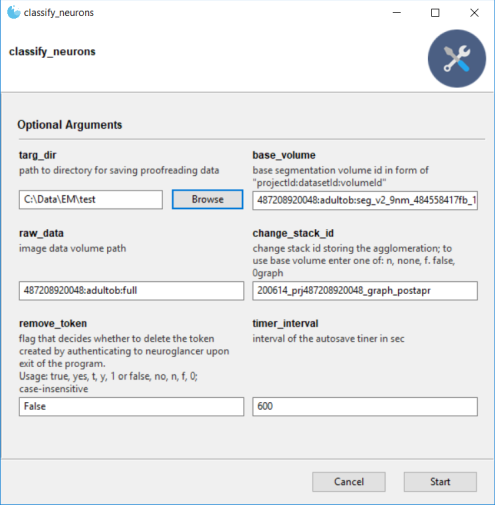

# Neuroglancer tool to classify neurons

## Prerequisites

+ requires [chrome](https://www.google.com/chrome/) and ChromeDriver to be 
installed. For ChromeDriver download and unzip 
the [ChromeDriver](https://chromedriver.chromium.org/downloads) for your 
chrome version and include the chrome driver location in your PATH environment 
variable. 

+ membership in the Google Cloud Project in which the segmentation is stored

unless a working exe is provided (then installation can be skipped and directly 
    continued to [Usage](https://github.com/moenigin/classify_neurons#usage)):

+ [anaconda](https://www.anaconda.com/distribution/) and git

## Installation

Create a folder for the proofreading tool and clone the git repository
```
cd <dir_path_to_tool>
git clone https://github.com/moenigin/classify_neurons.git
```
navigate to the proofreading folder and install the downloaded environment.yml,
```
cd .\classify_neurons
conda env create -f classify_neurons.yml
```

## Usage 
To run the program from console, activate the respective environment, navigate 
to the subfolder of the cloned repo and run
```
python cli.py
```


The json file in /data needs to be stored in a folder with known path. When the 
program is started it opens a dialog window in which the path to directory for saving 
proofreading data needs to be set to this folder. 



For usage instructions see [here](https://github.com/moenigin/classify_neurons/blob/main/manual.md)

